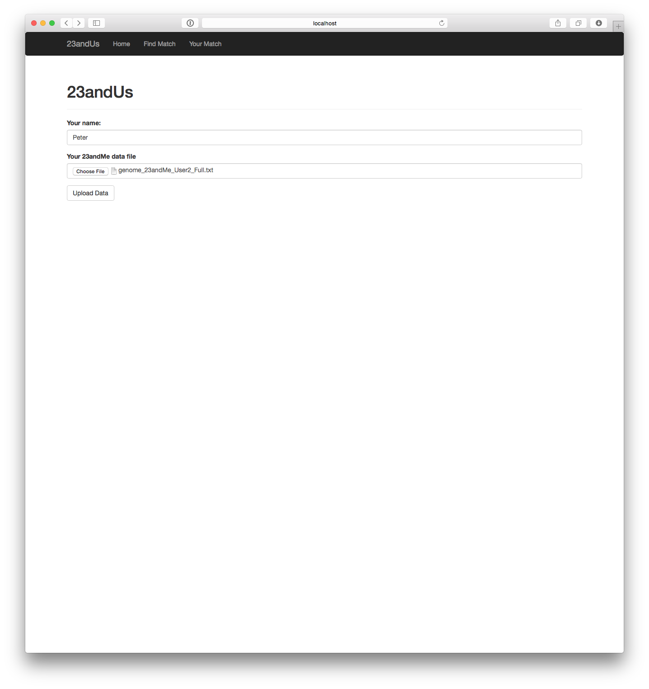
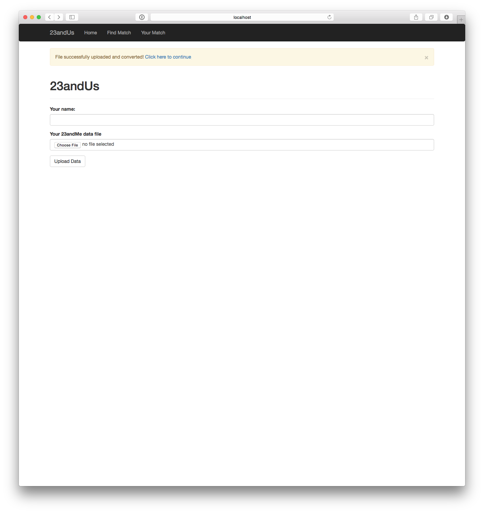
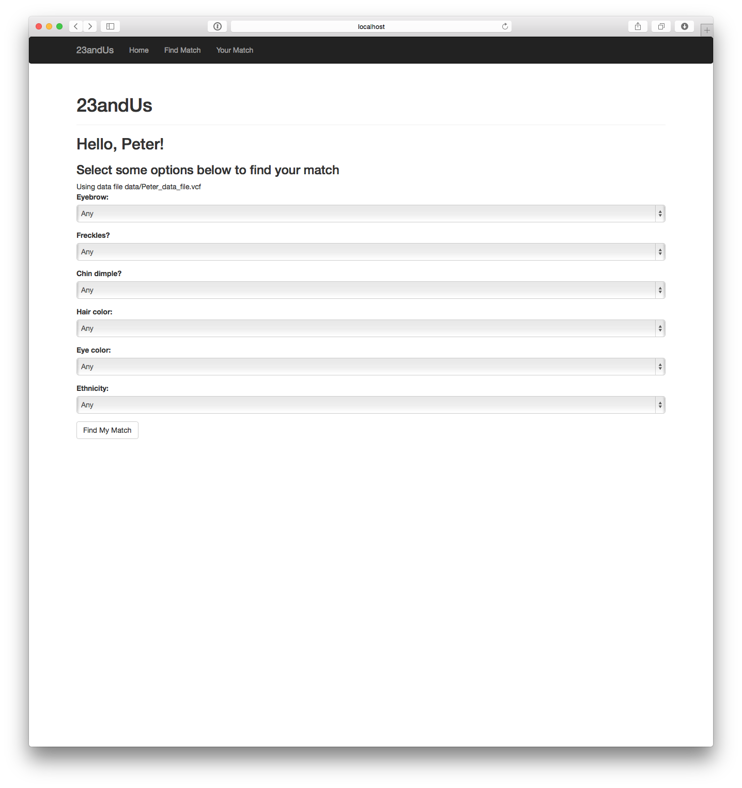
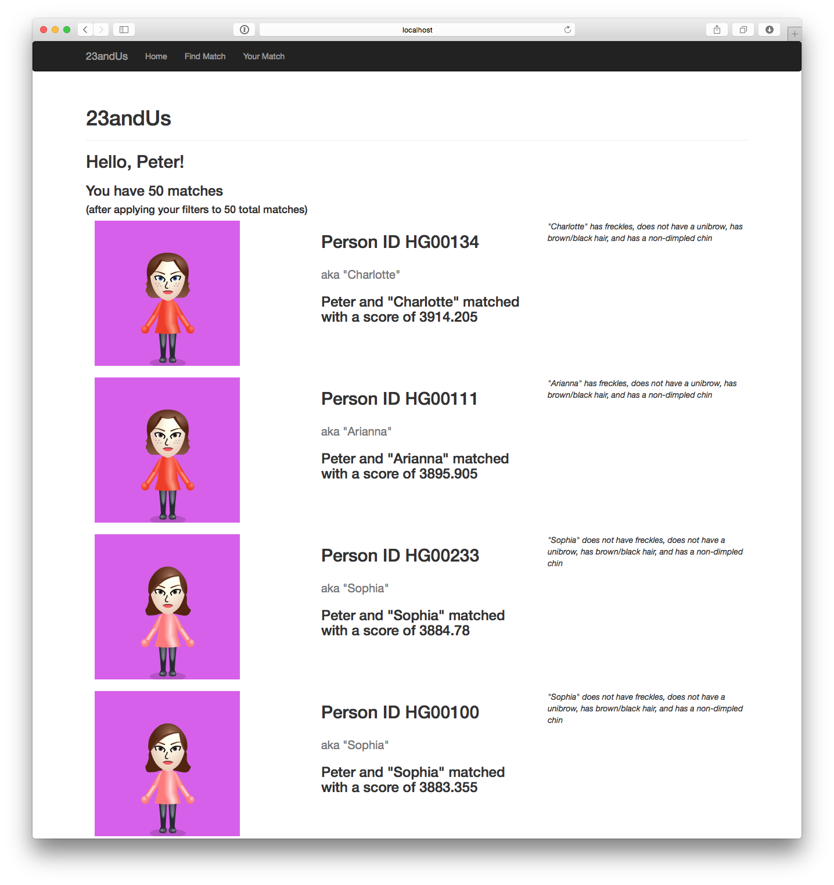

# 23andus
BD2K Hackathon / 23andUs project

# Getting started

* Python 3.4 required
* Recommended: create and activate a new venv

`pip install -r requirements.txt`

`python runserver.py`

# Genetic Matching in action!

